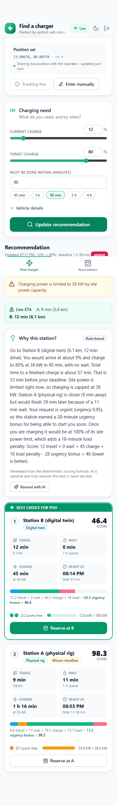
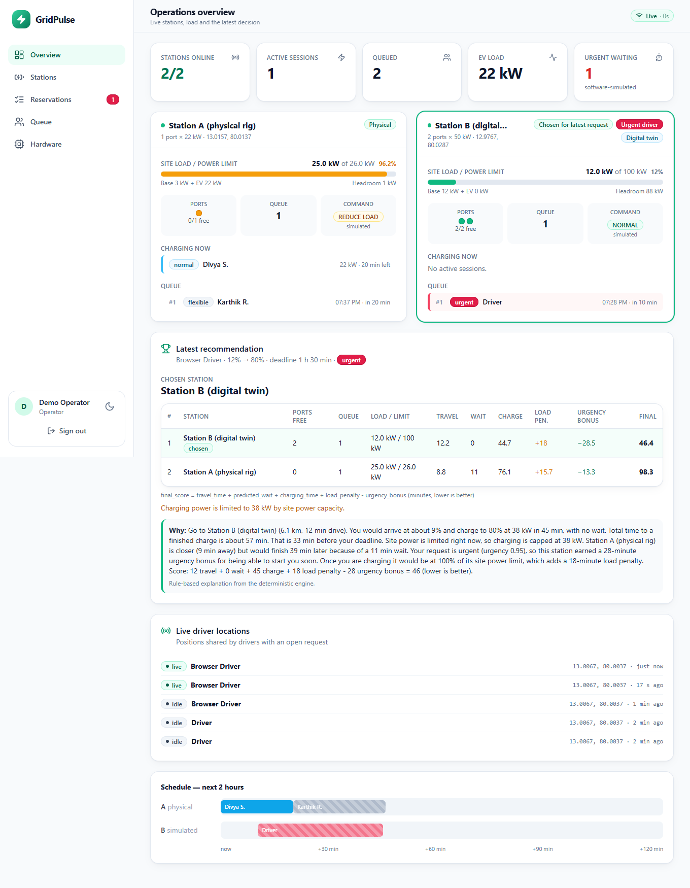
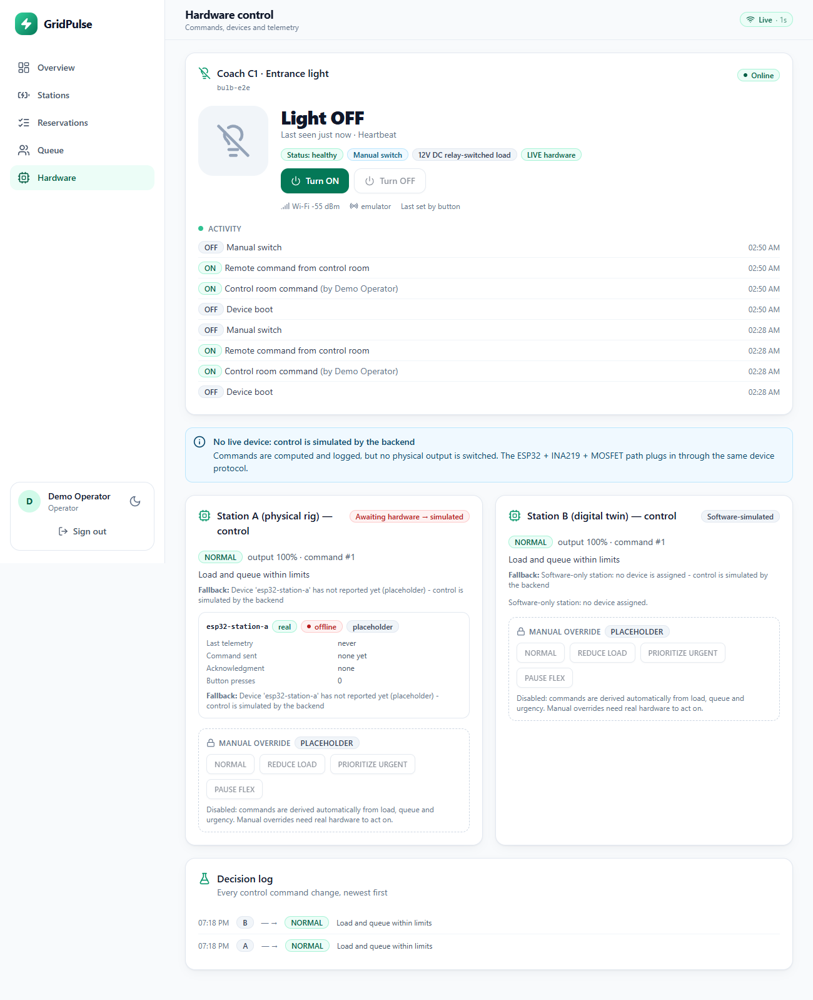

# GridPulse: final summary

**Live site:** https://gridpulse-topaz.vercel.app  ·  **API:** https://gridpulse-api-yjd1.onrender.com  ·  **Code:** https://github.com/yogeesh2007-bit/gridpulse

## What it is
A smart EV-charging recommendation, reservation and grid-aware control platform, plus a train coach-light control node, as one web app
on one URL. Decisions are deterministic (`final_score = travel_time + predicted_wait + charging_time + load_penalty - urgency_bonus`);
AI (OpenRouter) is optional and only rewords explanations.

| Layer | Stack |
|---|---|
| Frontend | React + Vite + TypeScript + Tailwind, on Vercel (`web/`); `/api` proxied to Render, WebSocket direct |
| Backend | FastAPI + SQLite, JWT access + rotating refresh tokens, roles (driver / operator), WebSockets, background scheduler, on Render (`backend/`) |
| Routing / geo | OSRM with haversine fallback; cached Nominatim reverse geocoding |
| Hardware | ESP32 firmware: station device (`firmware/esp32_station_a`), relay + button bulb node (`firmware/gridpulse_bulb_node`) |

## Screens
| Driver (phone) | Operator overview | Bulb node panel |
|---|---|---|
|  |  |  |

## Coach light (bulb-01): seeded data
No ESP32 is connected, so `bulb-01` is seeded as ordinary data (on first start and on *Reset demo data*): coach light, coach C1,
entrance/aisle zone, 12 V DC relay-switched load. History: boot (OFF) -> manual switch ON -> OFF -> ON; currently **ON**, in sync,
mode manual override, healthy. The Operator > Hardware tab turns it ON/OFF (the command is stored; a device applies it on its next poll).
Other lighting points and coach systems are seeded sample data and marked "Seeded". When an ESP32 is flashed with
`gridpulse_bulb_node` and its `config.h` (Wi-Fi + `DEVICE_API_KEY`), it reports through the same API and the seeded state gives way to real events.
Note: the node shows *Online* only while it reports (25 s window); a seed alone goes stale until a device or client heartbeats.

## Verification
* 227 backend tests (auth, API, realtime, engine, devices, bulb node), TypeScript build clean, firmware compiles (arduino-esp32 2.x and 3.x)
* Browser end-to-end tests (`scripts/e2e_browser.py`, `scripts/e2e_bulb.py`) and a live-site audit (`scripts/audit_live.py`)
* Not verified: the firmware on real hardware (board would not enter download mode on COM7)

## Open items
1. Flash the ESP32 (unplug relay/button wires, hold BOOT at "Connecting...") and paste `DEVICE_API_KEY` from Render into `config.h`.
2. Rotate the Wi-Fi hotspot password (it was shared in chat).
3. Optional hardening: security headers, hide `/docs` in production, real `NOMINATIM_USER_AGENT`, pin the TLS certificate in firmware.
4. Free Render sleeps when idle and resets its database on restart; use a paid plan with a disk for persistence.

See `README.md`, `docs/bulb-node.md`, `docs/deploy.md`, `docs/wiring.md`, `CLAUDE.md`.
